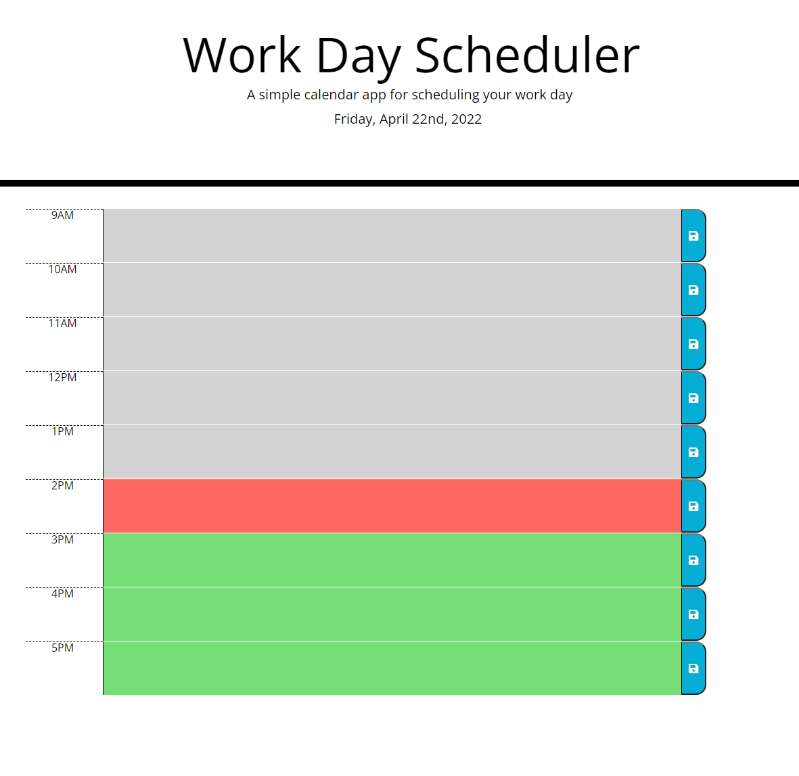

# ucb-challenge5

## Description
This is a daily scheduler which tracks the time of day with simple color coding. The current hour is highlighted in red, the future in green, and the past in gray.   
You can add tasks to each hour by clicking the center textarea and typing your task. Save tasks by clicking the blue save button on the right of each row. 

Link: https://ah-fang.github.io/ucb-challenge5/

##Screenshot
